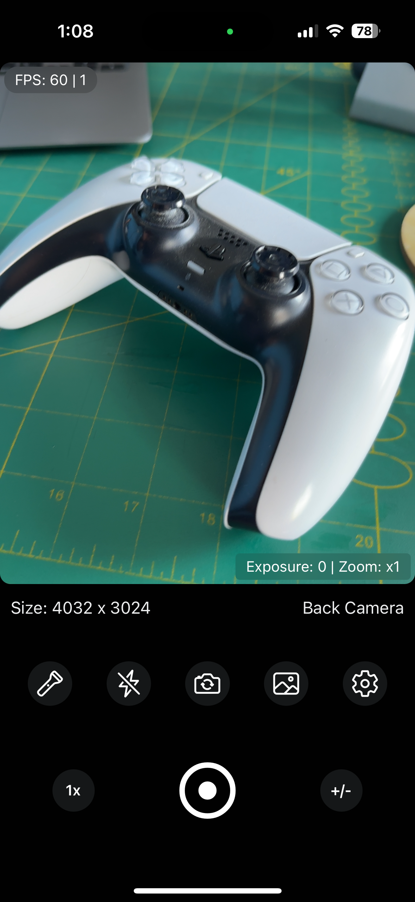
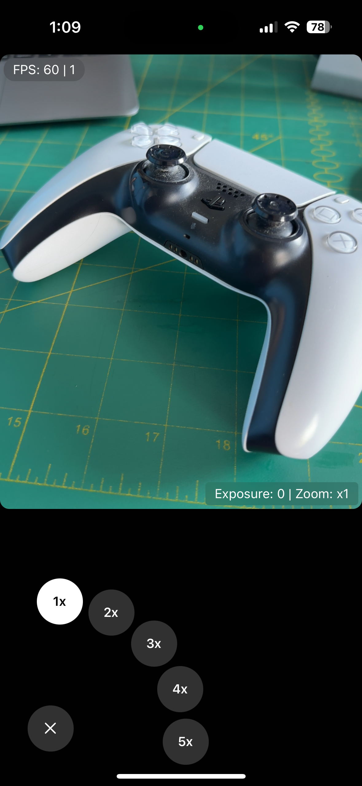
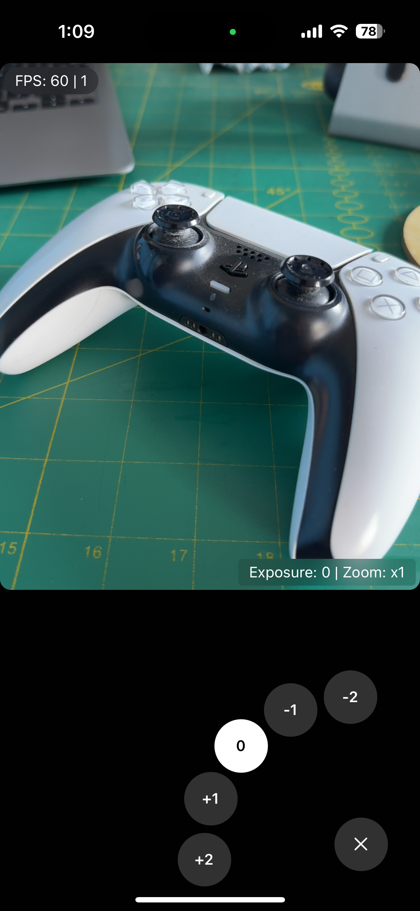
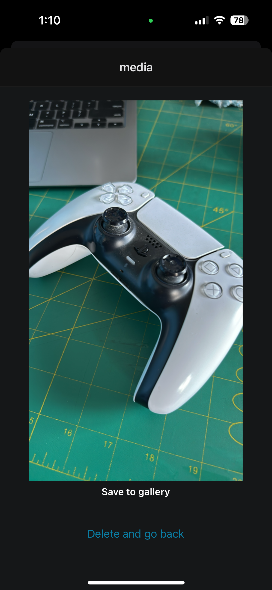

# Obscura Clone

This is a clone of the popular [Obscura](https://obscura.app/) app. It is built using React Native and Expo.

## Features

- Camera access
- Camera zoom and exposure controls
- Camera flash and torch controls
- Camera photo
- Gallery integration
- Permissions handling

## Screenshots

This project is created based on the Tutorial from [CodeWithBeto](https://www.youtube.com/watch?v=xNaGYGDZ2JU). 